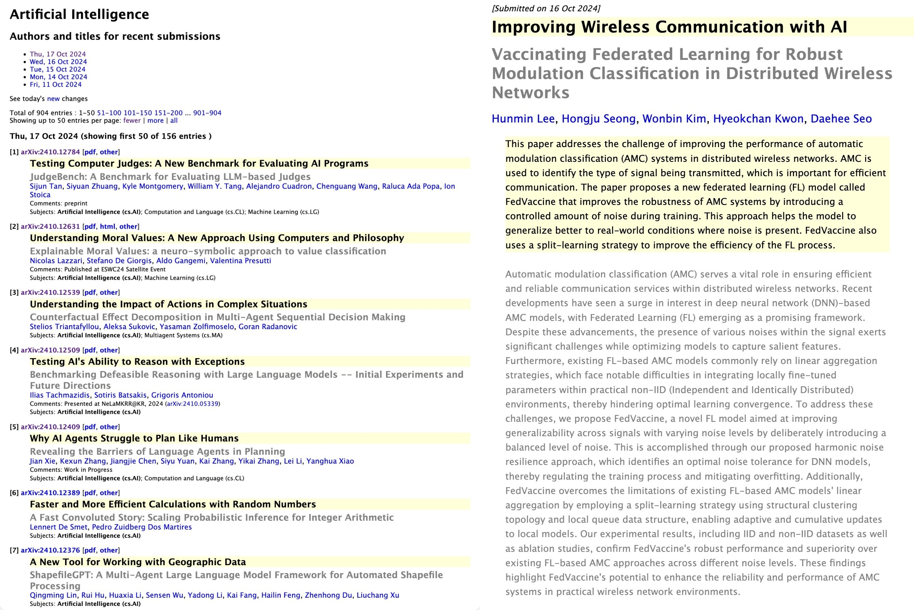

# Simplifi-Paper: A Chrome Extension for Simplifying arXiv Papers

This Chrome extension simplifies research papers from arXiv, making them easier to understand for readers without a strong background in the relevant field. It uses large language models (LLMs) to rewrite titles and abstracts into concise and accessible language.

